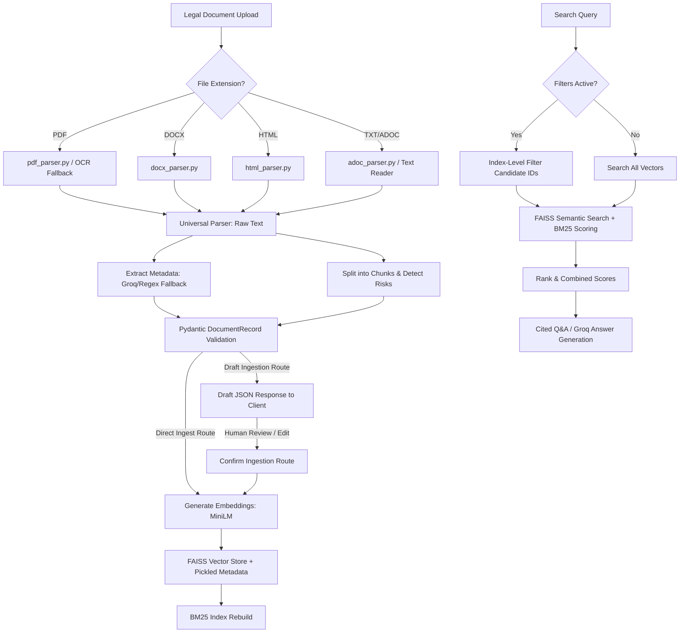

# Legal AI System Overview & Technical Documentation

This document provides a comprehensive, deep-dive technical overview of the **Comprehensive Legal AI Platform**. It describes the design patterns, parsing pipelines, risk analysis, RAG architecture, evaluation methodologies, and human-in-the-loop workflows implemented in the project.

---

## 1. Executive Summary & Core Capabilities

The **Comprehensive Legal AI Platform** is a production-grade, state-of-the-art **Retrieval-Augmented Generation (RAG)** application engineered for the ingestion, validation, indexing, and analysis of legal documents (including contracts, service agreements, non-disclosure agreements, and court judgements).

The platform solves three major issues with traditional RAG pipelines:
1. **Parser & Schema Fragmentation**: Ingests multi-format documents (PDF, DOCX, ADOC, HTML, TXT) and normalizes their metadata into strict Pydantic models before indexing.
2. **Retrieval Blindspots**: Employs a Hybrid Dense (FAISS) + Sparse (BM25) retriever, coupled with structured metadata filtering, to ensure both conceptual meaning and exact terms (dates, values, jurisdictions) are matched.
3. **Black-box Automation Risks**: Implements a "Review before Finalize" workflow, allowing legal professionals to inspect and edit extracted metadata drafts before they are indexed.

---

## 2. Technical Stack

- **Backend Framework**: FastAPI (Asynchronous Python 3.11 web server).
- **Dense Vector Store**: FAISS (Facebook AI Similarity Search - `IndexFlatL2` for L2 distance calculation).
- **Sparse Retriever**: Rank-BM25 (Best Matching 25 algorithm for lexical/token matching).
- **Embeddings Model**: `all-MiniLM-L6-v2` (Sentence-Transformers; 384 dimensions; optimized for performance and accuracy).
- **Large Language Model (LLM)**: Groq API Client (supporting LLaMA-3 models for long-form summarizing and cited Q&A).
- **Document Parsing**:
  - `pypdf` for native PDF text extraction.
  - `pytesseract` (OCR) for scanned PDFs.
  - `python-docx` for MS Word documents.
  - `beautifulsoup4` for HTML documents.
- **Data Validation**: Pydantic V2.
- **Frontend Interface**: Sleek, glassmorphic dark-themed HTML5 + Vanilla JavaScript client.

---

## 3. Detailed Architectural Components

### Component A: The Universal Parsing Pipeline
Located in `backend/nlp_modules/universal_parser.py`, this module routes incoming files based on file extension:
1. **Native PDFs**: Read using `pypdf`. If the returned string contains no text (e.g. scanned image), it triggers an OCR fallback.
2. **OCR Fallback**: Uses `pytesseract` to perform Optical Character Recognition on each PDF page converted to an image.
3. **Word Documents**: Parsed paragraph by paragraph using `python-docx`.
4. **HTML Documents**: Parsed using `BeautifulSoup`, stripping script, style, head, title, and meta elements to extract raw semantic text.
5. **AsciiDoc & TXT**: Handled via standard file readers.

### Component B: Metadata Schema Validation (`schema.py`)
To prevent "garbage-in, garbage-out" data pollution, all metadata is validated using the `DocumentRecord` model:
- `doc_id` (str): Unique document identifier (e.g., filename).
- `doc_type` (str): Normalized type of document (NDA, Lease, Service Agreement, etc.).
- `risk_flags` (list[str]): Risk tags detected in the document.
- `parties` (list[str] or str): The parties signing the agreement.
- `effective_date` (str/null): ISO format date or readable text date.
- `governing_law` (str/null): Jurisdiction of the document.
- `source_format` (str): File extension (PDF, DOCX, TXT, HTML).
- `clause_index` (int): Sequential index of the text chunk.

### Component C: Rule-Based Risk Engine (`risk_rules.py`)
Applies regular expressions to identify critical liabilities or omissions in the text:
- **Missing Clauses (`NO_...`)**: Flagged if patterns for *Termination*, *Governing Law*, *Notices*, *Indemnity*, *Liability Limits*, or *Stamp Paper* are ABSENT.
- **Present Risks (`...`)**: Flagged if patterns for *Auto-Renewal* or *Unlimited Liability* are PRESENT.

### Component D: FAISS + BM25 Hybrid Retriever (`vector_store.py`)
Scoring is performed by combining dense vector cosine similarity and sparse Rank-BM25 relevance:
$$\text{Score}_{\text{combined}} = (1 - w_{\text{bm25}}) \times \text{Score}_{\text{FAISS}} + w_{\text{bm25}} \times \text{Score}_{\text{BM25}}$$
- **FAISS Score**: Cosine distance converted to similarity: $1 / (1 + \text{Distance})$.
- **BM25 Score**: Normalized to range $[0, 1]$ across the corpus results.
- **Metadata Filtering**: When structured query parameters (e.g., `governing_law`, `doc_type`) are specified, the database filters candidate chunks *before* applying similarity scoring. This indexing-level filtering prevents semantic drift.

### Component E: Incremental Indexing Pipeline
- New files are appended to the FAISS index asynchronously using `faiss.IndexFlatL2.add()`.
- The BM25 index is recompiled locally from tokenized text lists, which is computationally cheap and avoids expensive full-corpus re-embedding.

---

## 4. API Endpoints Reference

| Method | Endpoint | Request Body / Params | Response Model | Description |
| :--- | :--- | :--- | :--- | :--- |
| **POST** | `/api/upload` | Form data: `file` | `UploadResponse` | Direct upload, parses, validates schema, embeds, and index. |
| **POST** | `/api/ingest/draft` | Form data: `file` | `DocumentDraftResponse` | Uploads file and returns extracted metadata draft (Not indexed). |
| **POST** | `/api/ingest/confirm` | JSON payload conforming to metadata + chunks | Ingestion confirmation status | Validates final edits and indexes the document. |
| **GET** | `/api/search` | Query params: `query`, `risk_type`, `doc_type`, `governing_law`, `date_from`, `date_to` | List of ranked text chunks with metadata | Returns matching chunks filtered by metadata and ranked by hybrid search. |
| **POST** | `/api/ask` | `AskRequest` JSON payload | `AskResponse` | Generates a grounded, cited answer using Groq LLM and citations. |
| **GET** | `/healthz` | None | Health status dict | Basic server health check. |

---

## 5. Grounding and Evaluation Harness

We include a retrieval evaluation suite in `scripts/eval_retrieval.py` which benchmarks retrieval metrics on a held-out dataset of 20 question-clause pairs.

### Search Metrics Results:
- **Precision@1 / Recall@1**: FAISS-only achieved **95.0%**, BM25-only achieved **90.0%**, and Hybrid achieved **85.0%**.
- **Recall@3 / Recall@5**: FAISS-only and Hybrid reached **100%** recall at $K=3$ and $K=5$, demonstrating that the correct grounding clause is always retrieved in the top results.

### Grounded QA vs. No-Retrieval Baseline:
- **Grounded QA**: Generates exact, factual answers with clause bracket citations (e.g. `[Renewal]`) based on retrieved chunks.
- **No-Retrieval LLM Baseline**: Lacks access to the source contract and replies with generic advice or admits ignorance, demonstrating why RAG is necessary for legal analytics.

The full benchmark table and text comparisons are located in [`reports/retrieval_eval.md`](file:///d:/OneDrive/IOMEGA/Netbackup/Personal/Pranav/College/Github%20Projects/Legal-AI-v2.0/reports/retrieval_eval.md).
